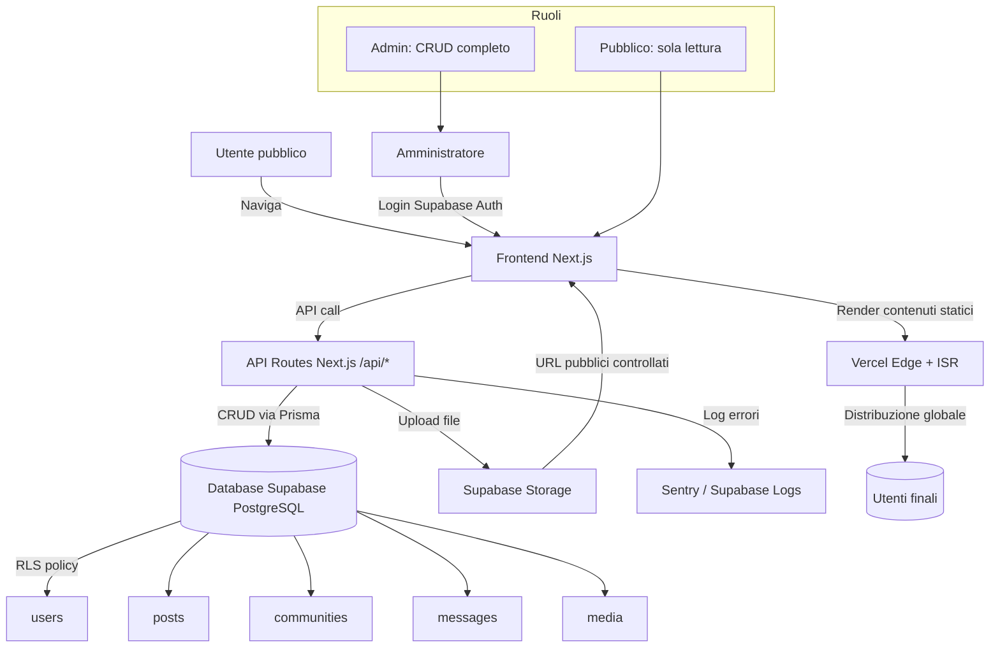

# Documento di Architettura Tecnica
**Progetto:** Escola Comunitária Novo Horizonte  
**Data:** 2025-11-10  
**Versione:** 1.0 – MVP Greenfield

---

## 1. Contesto e obiettivi
Il sistema deve fornire un portale pubblico (storytelling, comunità, blog) e un pannello admin protetto per creare, modificare e pubblicare contenuti.  
Stack scelto: **Next.js + TypeScript + TailwindCSS + Prisma + Supabase (Auth + DB + Storage)** con deploy su **Vercel**.  
Obiettivi principali:  
- separazione tra vista pubblica e area riservata admin;  
- autenticazione sicura e unica (ruolo admin);  
- alta performance anche con connessioni lente;  
- struttura dati chiara per comunità, post e messaggi;  
- semplicità di manutenzione e aggiornamento.  

---

## 2. Ragionamento architetturale
1. Il requisito funzionale distingue pubblico e amministratore → due superfici: pagine pubbliche e area `/admin`.  
2. Next.js permette frontend e API integrate; Prisma funge da layer ORM per Supabase PostgreSQL.  
3. Supabase/Auth gestisce login e storage dei file (immagini comunità).  
4. Vercel gestisce build e distribuzione statica, garantendo scalabilità automatica.  
5. L’architettura punta alla semplicità e rapidità di sviluppo, con basi già pronte per la v2 (multi-ruolo e API dedicate).  

---

## 3. Critica e raffinamento
**Punti di forza:** stack moderno, deployment semplificato, architettura fullstack compatta.  
**Migliorie:**  
- prevedere separazione futura tra API e frontend;  
- introdurre caching (ISR e edge cache);  
- regole naming e cleanup su Supabase Storage;  
- predisposizione ruoli per v2;  
- osservabilità (Sentry o Supabase logs).  

---

## 4. Flusso logico e coerenza
1. **Frontend (Next.js)**: pagine pubbliche + `/admin` protetta da Supabase Auth.  
2. **Backend (API Routes + Prisma)**: gestisce CRUD di post, comunità e messaggi.  
3. **Database e Storage (Supabase)**: PostgreSQL con RLS, tabelle `users`, `posts`, `communities`, `messages`, `media`.  
4. **Deployment (Vercel)**: ISR per pagine pubbliche, edge caching e log automatici.  

**Coerenza:** architettura lineare, facilmente estendibile. Unico rischio: crescita futura del backend integrato, mitigabile con servizi esterni.

---

## 5. Rischi architetturali e mitigazioni
| Rischio | Descrizione | Mitigazione |
|----------|--------------|-------------|
| Scalabilità backend | Carico alto su API Next | Spostare API su Supabase Functions / microservizi |
| Affidabilità storage | Disordine o lentezza media | Naming coerente e cleanup periodico |
| RLS mal configurato | Esposizione dati riservati | Policy minime e test accessi |
| Assenza cache | Pagine lente in Africa | ISR + caching edge |
| Error handling/log | Difficoltà debugging | Integrazione Sentry / Supabase logs |
| Singolo admin | Blocco operativo | Struttura ruoli predisposta |

---

## 6. Vista logica (componenti e relazioni)

---

## 7. Visione futura (v2)
- Separazione API → servizio Node indipendente o Supabase Edge Functions.  
- Ruoli multipli (admin, editor, volontario).  
- CDN dedicata per media.  
- Sezione “Impatto” con grafici e dati dinamici.  
- Multilingua e PWA offline-ready.  

---

## 8. Considerazioni finali
L’architettura è **coerente con l’MVP** e bilancia semplicità e robustezza.  
Garantisce manutenzione minima e alta adattabilità per l’evoluzione del progetto.  
