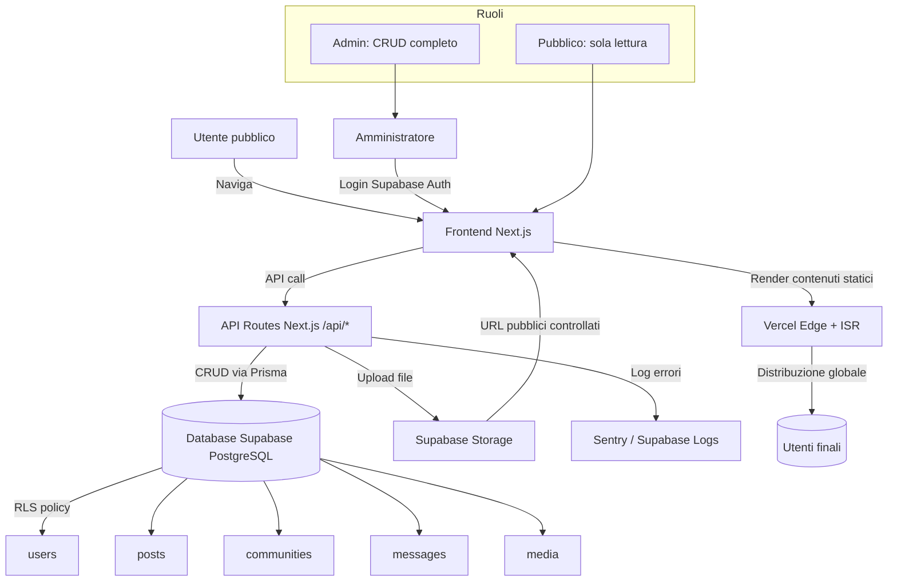

# 6. Vista logica (componenti e relazioni)

```mermaid
graph TD
  A[Utente pubblico] -->|Naviga| B[Frontend Next.js]
  Admin[Amministratore] -->|Login Supabase Auth| B

  B -->|API call| C[API Routes Next.js /api/*]
  C -->|CRUD via Prisma| D[(Database Supabase PostgreSQL)]
  C -->|Upload file| E[Supabase Storage]

  D -->|RLS policy| D1[users]
  D --> D2[posts]
  D --> D3[communities]
  D --> D4[messages]
  D --> D5[media]

  E -->|URL pubblici controllati| B
  B -->|Render contenuti statici| V[Vercel Edge + ISR]

  C -->|Log errori| L[Sentry / Supabase Logs]
  V -->|Distribuzione globale| U[(Utenti finali)]

  subgraph Ruoli
    R1[Pubblico: sola lettura]
    R2[Admin: CRUD completo]
  end
  R1 --> B
  R2 --> Admin
```

---
